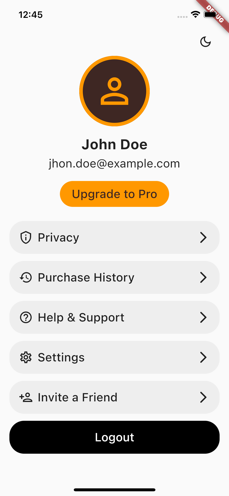
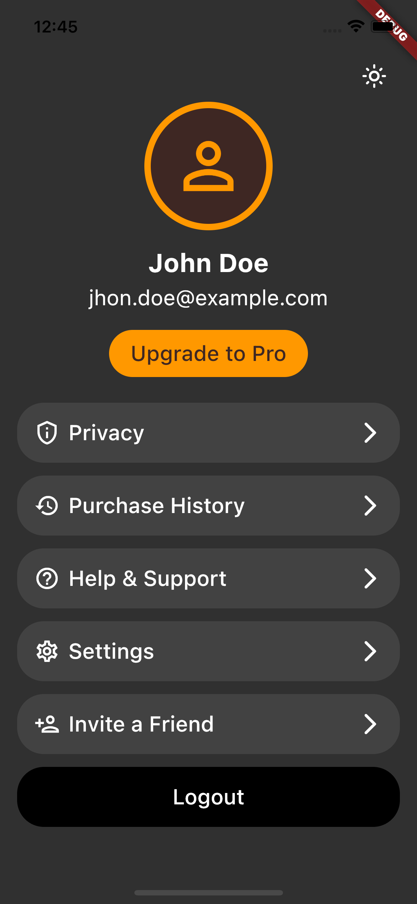

# login_screen

A test Flutter project.

<!-- GETTING STARTED -->

## Getting Started

`flutter: ^2.10.3`

To get a local copy up and running follow these simple example steps.

Prerequisite: https://flutter.dev/docs/get-started/install

1. To get started, fork this repository to your GitHub account.

2. Clone the repo.
    ```sh
     git clone https://github.com/<your-username>/login_screen.git
    ```
3. Install packages.
    ```sh
     flutter pub get
    ```
4. Run project.
    ```sh
     flutter run
    ```

## Getting Started

| Light Mode                                               | Dark Mode                                              |   
|:--------------------------------------------------------:|:------------------------------------------------------:|
| </img> | </img> |